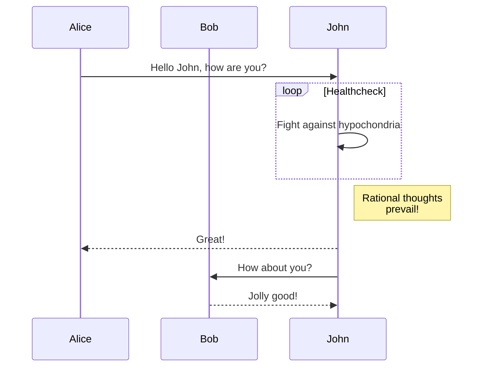

%title A great title
%author truelossless
%author anonymous
%license MIT

# A weird first part

HEY LOOK I'M _ SUPER **BOLD** _

`console.log()` rocks even if it's a little bit long to type.

## A sketchy first point

Let's talk about **something** here!

<b>With some HTML to spice things up</b>

Here's a block of LaTeX

$$
f'(x) = \dfrac{2x}{\sqrt{3x}}
\int_{0}^{\pi} sin(x) dx
$$

## An awkward second point

Lorem ipsum dolor sit amet, consectetur adipiscing elit. Pellentesque cursus erat sed mollis semper. Aenean vulputate, lectus id rhoncus ornare, enim nisl sodales libero, non faucibus odio velit viverra magna. Pellentesque habitant morbi tristique senectus et netus et malesuada fames ac turpis egestas. Donec pretium leo sed leo euismod tincidunt. Nullam vitae nisl quis odio ultrices accumsan. Duis eget enim in ipsum interdum pulvinar. Interdum et malesuada fames ac ante ipsum primis in faucibus. Donec pulvinar hendrerit quam, nec iaculis dolor iaculis ut. Cras ac turpis ut velit consectetur tincidunt. Mauris consequat, nisi quis malesuada elementum, elit odio luctus est, eu consequat mi erat et turpis. Morbi vitae nisl ut odio congue aliquam at eu mi. Ut luctus orci faucibus aliquam vehicula. Nam aliquet venenatis maximus. Curabitur tempor condimentum porta.

### We even have third points now !

Here is some inline latex: $\sigma = 3$

And here's some code to finish:

```js
function transpile() {
  var i, j, k;
  console.log(i, j, k);
}
```

# Another important topic to bring up

Can you guess the subject of this one?
Click this [link](https://google.fr) to find out!

## First point

Hehe there's still more to read there!

---

Here's a picture for you:


You can also include local pictures, and it will be embedded in the pdf / html!

## Random citation

Here's a quote for you:

> Hey look buddy, I'm an engineer. That means I solve problems, not problems like "What is beauty?" Because that would fall within the purview of your conundrums of philosophy. I solve practical problems, for instance: how am I going to stop some mean mother Hubbard from tearing me a structurally superfluous be-hind? The answer, use a gun, and if that don't work... Use more gun. Take for instance this heavy caliber tripod mounted lil' old number designed by me, built by me, and you best hope... Not pointed at you.

Where does this come from?

## Sexy Boxes :3

?> Be careful of what you're doing!

!> You could **DESTROY** something!

x> And here we go :S

## (Not bugged anymore) Lists :3

- First item
    More content on this first item ...
    - Nested sublist
    - Another good point
        - Nested nested sublist!!
        Incredible, isn't it?
- Second item
- Third item

Make sure to use one tabulation or four spaces for it to be working correctly !

# Hot new features right there B)

## Tables for everyone!!


| topic       | description                                 |
|-------------|---------------------------------------------|
| gaming      | playing video games with friends            |
| cooking     | making *good* recipes                       |
| hiking      | walking in moutains is **hard**             |
| programming | using the computer to produce fancy visuals |

## Mermaid diagrams

Mermaid diagrams baby! You can sketch diagrams in a markdownish flavor. This one is from the official docs. You know what's even crazier? They are dark-theme compatible!

